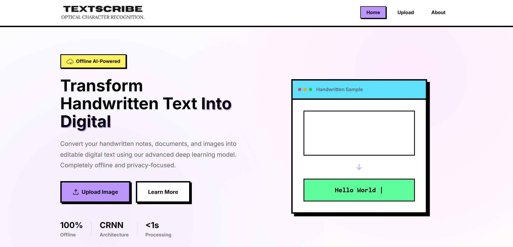

# TextScribe OCR



TextScribe OCR API is a powerful optical character recognition (OCR) application powered by PaddleOCR and built on FastAPI. It processes images using a custom pipeline involving text type classification, image preprocessing, and robust OCR. It provides an intuitive Web GUI, RESTful endpoints, and seamless integration for extracting text from images.

## Features

- **FastAPI Backend:** High performance server infrastructure utilizing asynchronous endpoints.
- **Custom OCR Pipeline:** Deep integrations with PaddlePaddle and PaddleOCR for high-accuracy text extraction.
- **Web Interface:** HTML interface directly served by FastAPI for real-time testing and user interaction.
- **Multiple REST API Endpoints:** 
  - Standard File Upload (`/api/v1/ocr/recognize`)
  - Base64 Encoded Images (`/api/v1/ocr/recognize-base64`)
  - Batch Processing (`/api/v1/ocr/batch`)
- **Automated Startup Script:** Simple one-click initialization on Windows to handle all dependencies.

## Project Structure

- `app.py`: Main FastAPI application, API routing, and system logic.
- `pipeline/`: Core logic for text type detection and PaddleOCR wrapper implementations.
- `start.bat`: Automated initialization script that checks dependencies, creates virtual environments, installs requirements, and launches the ASGI server.
- `requirements.txt`: Python package dependencies.
- `html/` & `static/`: Frontend code and static assets for the web demo.
- `uploads/`: Temporary directory where uploaded files are stored and purged during requests.

## Installation and Usage (Windows)

The application provides a fully automated `start.bat` script handling dependency installations and virtual environment setups.

1. Ensure you have **Python 3.10+** installed and added to your system `PATH`.
2. Clone or download the repository to your local machine.
3. Launch the server by simply double-clicking on `start.bat`. Upon initial run, it will automatically:
   - Create a Python virtual environment locally in the `venv/` directory.
   - Upgrade Pip and install the required modules from `requirements.txt` (including PaddlePaddle and PaddleOCR).
   - Start the FastAPI Uvicorn server on port `8081`. 
4. Once the server is live, the console will output the local URL. Navigate to the following address in your browser:
   ```
   http://localhost:8081
   ```

### Manual Installation (OS Agnostic)

If prefer manual installation or are on a non-Windows OS, you can start the application via command line:

```bash
# Clone the repository
git clone <your-repo-url>
cd TextScribe

# Create and activate virtual environment
python -m venv venv
source venv/bin/activate       # macOS/Linux
venv\Scripts\activate.bat      # Windows

# Install dependencies
pip install -r requirements.txt

# Start the application
uvicorn app:app --host 0.0.0.0 --port 8081 --reload
```

## API Referance

### 1. Health Check
`GET /api/v1/health`
Check the health status and server uptime.

### 2. Standard OCR Upload
`POST /api/v1/ocr/recognize`
Perform OCR via multipart file upload.
- Allowed limitations: `10MB` limit minimum.

### 3. Base64 Image OCR
`POST /api/v1/ocr/recognize-base64`
Upload an image via Base64 JSON payload.
**Request Body**:
```json
{
  "image_base64": "data:image/jpeg;base64,/9j/4AAQSkZJ...",
  "lang": "en",
  "use_angle_cls": true,
  "morph_op": "dilate",
  "decoder": "greedy"
}
```

### 4. Batch OCR
`POST /api/v1/ocr/batch`
Upload multiple files simultaneously for batch OCR detection.

## Core Dependencies

- **Framework**: `fastapi`, `uvicorn`, `python-multipart`
- **Machine Learning Core**: `paddlepaddle`, `paddleocr`
- **Computer Vision**: `opencv-python`, `scikit-image`, `Pillow`, `numpy`

## License
This project is licensed under the **MIT License**.
